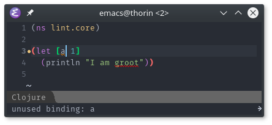

# clojure-lint layer

Enables clojure-mode, flycheck and
[flycheck-joker](https://github.com/candid82/flycheck-joker). Uses
[joker](https://github.com/candid82/joker) for linting in Clojure(Script).
Therefore, you have to install joker and make sure it is a binary in the path,
e.g. with

    yaourt -S joker

## Installation

Clone this repository to a location where you store your private layers, e.g. `~/.emacs.layers`

    git clone https://github.com/n2o/clojure-lint-spacemacs-layer ~/.emacs.layers
    
Then link this layer into your `.emacs.d` folder:

    ln -s ~/.emacs.layers/clojure-lint/ ~/.emacs.d/private/clojure-lint
    
At last, add the new layer `clojure-lint` to your dotspacemacs-configuration-layers.

## Usage

This automatically enables flycheck-mode with flycheck-joker on Clojure-files
and lints your code. No additional steps should be required.
